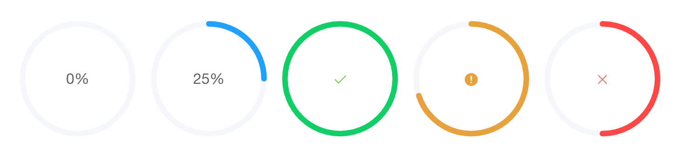
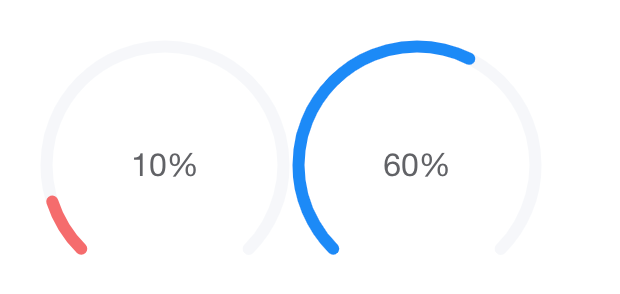
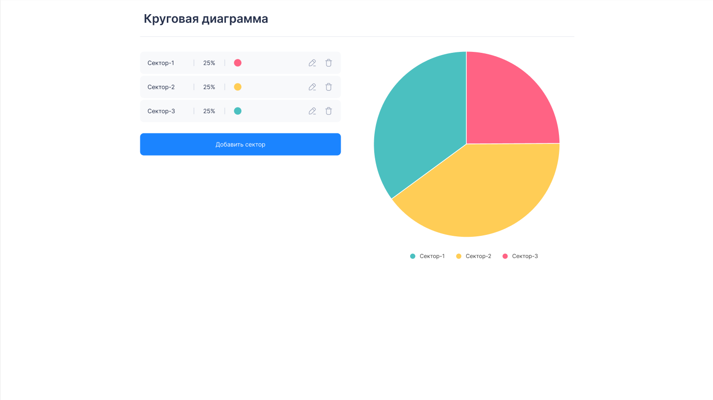
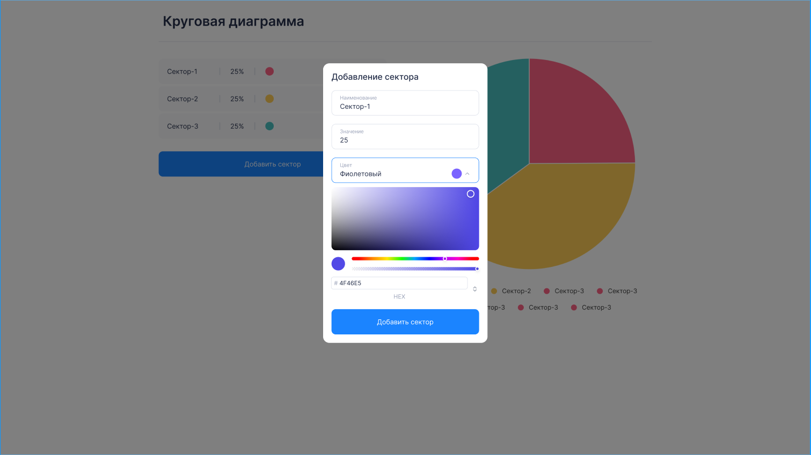

# test-task

Во многих вакансиях просят "ссылку на github" или примеры кода.
Поскольку практически весь мой фронтовый код был написан под NDA, и встретив в описании вакансии предложение сразу начать с тестового задания, я решил таки его сделать дабы потом на него ссылаться, как на "пример кода".

[Здесь](https://career.habr.com/dimsim) немого про меня и мой путь.

Для связи, лучше писать в [telegram](https://t.me/dimsimer).

[Задание](https://www.dropbox.com/scl/fi/4vkk87ybcyq3co296d1ht/%D0%A2%D0%B5%D1%81%D1%82%D0%BE%D0%B2%D0%BE%D0%B5-%D0%B7%D0%B0%D0%B4%D0%B0%D0%BD%D0%B8%D0%B5.paper?dl=0&rlkey=ll8zagkqphw0lamrcu68dddri&st=94gglnpg) состояло из двух задач:

### Задача 1

Реализовать на Vue 3 (composition api) без использования сторонних библиотек компонент кругового прогресс бара. В реализации использовать SVG, не canvas. Реализация и через svg и через canvas будет плюсом, но обязательная программа - SVG.

Прогрессбар имеет 4 состояния - in progress, success, warning, error.
При изменении значения прогресс бара анимация увеличения должна быть плавной. Изменения статуса так же должно быть плавным.
По мере увеличения значения прогресс бара цвет заполненного сектора окружности меняется от красного к зеленому.
Компонент должен быть полноценным, готовым к использованию в проекте. Подготовить страницу с демонстрацией возможностей компонента.
   
Так же должна быть возможность изменить тип прогресс бара на dashboard, в таком случае он должен изменить форму на следующую:
   
   

### Задача 2

Делать в том же проекте, отдельная страница, так же vue, так же composition api.
Реализовать круговую диаграмму используя библиотеку chartjs. Так же реализовать форму, состоящую из полей: наименование, значение, цвет. Для выбора цвета использовать color picker из какой-нибудь сторонней библиотеки, например [вот этой](https://www.npmjs.com/package/vue-colour-picker).
При добавлении элемента через форму добавлять его в pie chart. Элементы должно быть можно удалять и редактировать. Реализовать в соответствии с [дизайном](https://www.figma.com/design/wlwVRFgUH1BYsAOKgylnzY/Untitled?node-id=0-1&t=a2W3WL18kEtD7ZI3-1)


В отношении color picker строгое соответствие дизайна не требуется, главное чтобы цвет выбирался.
Наличие адаптива приветствуется.

Проект разместить в публичном репозитории github.

## Некоторые комментарии к проекту

1. Сначала показалось что самым сложным будет задача 1, т.к. с svg плотно не работал. Но немного погуглив, реализовал ее достаточно быстро.
2. Задача 2, наооборот, казалась несложной, но когда дошло дело до SelectBox'а с цветом на диалоге, стало понятно, что постановщик задачи постеснялся описать логику его работы... В общем пришлось придумывать самому. Кроме того, сделал для себя "открытите", что невозможно реализовать верстку внутри ``<option/>`` для стандартного ``<select/>``. Поэтому пришлось делать кастомный "SelectBox" (про что в задаче в явном виде не написано, но при этом есть намек на минимизацию использования сторонних библиотек).
3. Поскольку за основу был взят дефолтный стартовый проект vue3, то бонусом пришла "темная/светлая" тема (переключается в настройках браузера).
4. Наличие адаптива. Ну во всяком случае оно предполагалось :)

## Запуск, как водится

```sh
npm install
```

## Компиляция и хот-релоад в режиме разработки

```sh
npm run dev
```

## Проверка типов, компиляция и минификация для продакшена

```sh
npm run build
```